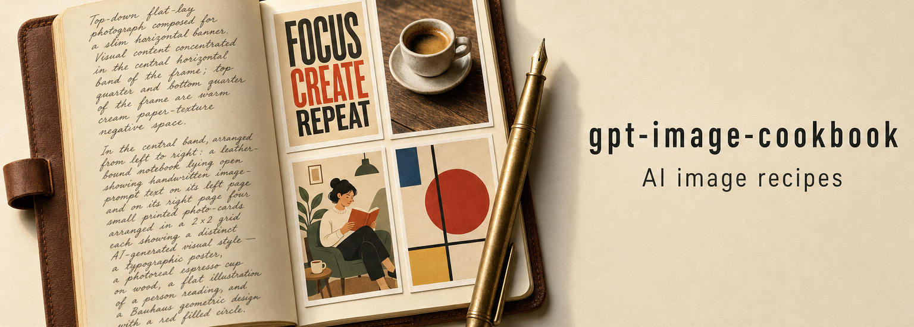
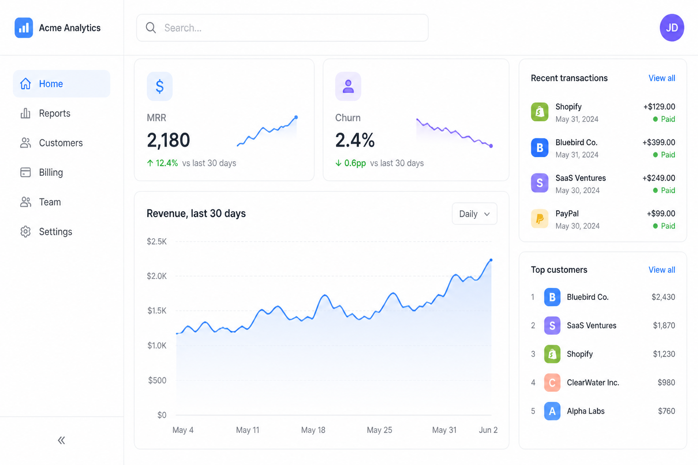
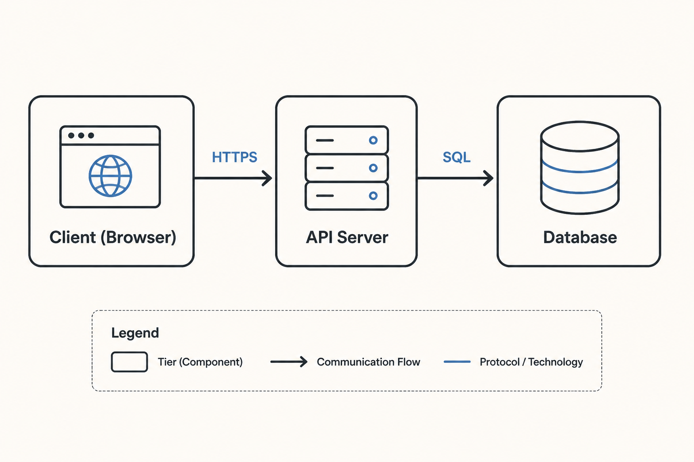
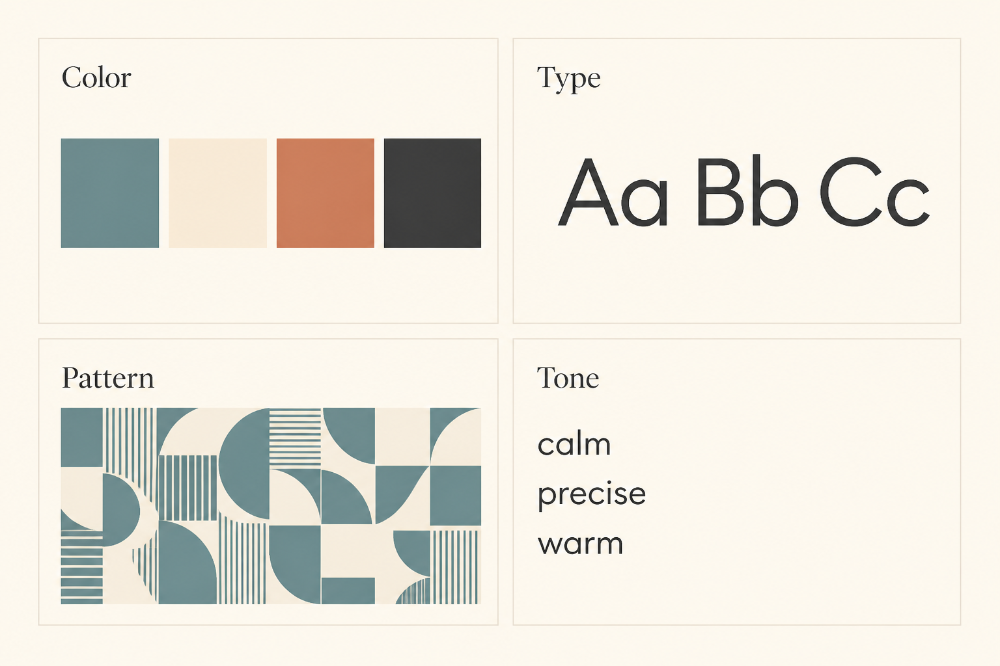

<p align="center">
  <a href="https://github.com/eugeniughelbur/gpt-image-cookbook"></a>
</p>

<h1 align="center">gpt-image-cookbook</h1>

<p align="center"><em>Multi-provider AI image generation cookbook — prompt gallery, agentic skill, and CLI for OpenAI, Atlas Cloud, Google Imagen, Flux, and more.</em></p>

<p align="center">
  
  
  
</p>

---

**gpt-image-cookbook** is an open-source multi-provider AI image generation toolkit that bundles a curated prompt gallery, an agentic skill (`SKILL.md` runbook for Claude Code, Codex, OpenClaw, and Hermes), and a Python CLI (`gic`) into one repository. It supports **OpenAI gpt-image-2**, **Atlas Cloud**, **Google Imagen**, and **Flux** (fal.ai / Replicate) under a single interface for text-to-image generation, reference-image editing, inpainting, and multi-reference workflows.

If you build with AI image models, this gives you copy-paste prompts that work, a CLI that handles auth and edits, and an agent runbook that wires it all together.

---

## What this is

Three things bundled together:

1. **A curated prompt gallery** — copy-paste prompts organized by category (posters, UI mockups, photography, diagrams, brand systems, edit/inpaint workflows) that produce reliable results across providers.
2. **An agentic skill** — `SKILL.md` runbook for Claude Code, Codex, OpenClaw, Hermes, and other skill-capable agent runtimes. Tells the agent how to search the gallery, refine the prompt, and call the CLI without writing one-off scripts.
3. **A CLI (`gic`)** — one command, multiple providers. Switch between OpenAI `gpt-image-2`, Atlas Cloud, Google Imagen, and Flux with a single `--provider` flag.

---

## Sample outputs

A glance at what the cookbook produces. Every image below was generated by `gic` itself; the full prompts live in `skills/gpt-image-cookbook/references/gallery-*.md`.

<table>
  <tr>
    <td width="33%"></td>
    <td width="33%"></td>
    <td width="33%"></td>
  </tr>
  <tr>
    <td align="center"><sub><b>Posters</b> — type-led, exact text</sub></td>
    <td align="center"><sub><b>UI / UX</b> — dashboards, app screens</sub></td>
    <td align="center"><sub><b>Photography</b> — portraits, products</sub></td>
  </tr>
  <tr>
    <td></td>
    <td></td>
    <td></td>
  </tr>
  <tr>
    <td align="center"><sub><b>Illustration</b> — flat, line, editorial</sub></td>
    <td align="center"><sub><b>Diagrams</b> — figures, architectures</sub></td>
    <td align="center"><sub><b>Brand</b> — logos, moodboards, systems</sub></td>
  </tr>
</table>

→ See the [full gallery](skills/gpt-image-cookbook/references/gallery.md) for prompts, provider/model/quality settings, and notes on what makes each pattern work.

---

## Why a cookbook

Most prompt galleries are read-only inspiration. This one is wired into an agent that *uses* the gallery: search → refine → generate, with consistent semantics across providers. The CLI handles auth, encoding, sizing, edits, and inpainting so the agent never reinvents API plumbing.

---

## Install

```bash
# pip
pip install gpt-image-cookbook

# or one-shot via uvx
uvx --from git+https://github.com/eugeniughelbur/gpt-image-cookbook gic --help
```

Set at least one provider key:

```bash
export OPENAI_API_KEY=sk-...        # for openai (default)
export ATLASCLOUD_API_KEY=...       # for atlascloud
export GOOGLE_API_KEY=...           # for imagen
export FAL_KEY=...                  # for flux
```

The CLI also reads `./.env` and `~/.env` (without overriding env vars already set).

---

## Quickstart

```bash
# Text-to-image, OpenAI default
gic -p "A minimalist conference poster, headline reads exactly 'Signal over Noise'" --quality high --size portrait

# Reference edit
gic -p "Make the sky a stormy sunset" -i ref.png

# Inpaint
gic -p "Replace the masked area with a coffee cup" -i ref.png -m mask.png

# Switch provider
gic -p "Photoreal product shot of a ceramic mug on oak" --provider imagen --quality high

# Atlas Cloud (asynchronous submit + prediction polling)
gic -p "Editorial product photo on a white studio background" --provider atlascloud --size landscape
```

Outputs land in `./generated/<timestamp>-<slug>.png` unless you pass `-f`.

---

## Use as a Claude Code plugin

```bash
# In Claude Code
/plugin install eugeniughelbur/gpt-image-cookbook
```

The agent loads `skills/gpt-image-cookbook/SKILL.md`, follows the operating loop (classify → search gallery → refine → generate), and calls `gic` for you.

---

## Use as an agent skill (Codex, OpenClaw, Hermes, …)

Point your runtime at `skills/gpt-image-cookbook/SKILL.md`. Compatible runtimes auto-resolve the `gic` CLI via `command -v gic`, `uv`, or `uvx`.

---

## Repo layout

```
.claude-plugin/        # Claude Code plugin + marketplace metadata
skills/
  gpt-image-cookbook/
    SKILL.md           # agent runbook
    references/        # gallery routing index, per-category prompts, craft cheatsheet
    scripts/           # generate.py launcher
    agents/            # runtime metadata for OpenClaw / Hermes / etc.
src/gic/               # the CLI (Python)
docs/                  # gallery thumbnails (added as you build entries)
```

---

## CLI reference

| Flag | Values | Use |
|---|---|---|
| `-p, --prompt` | string | required prompt or edit instruction |
| `-f, --file` | path | output path; auto-named if omitted |
| `-i, --image` | repeatable path | reference image; switches to edits endpoint |
| `-m, --mask` | PNG path | alpha mask for inpaint; requires `-i` |
| `--provider` | `openai`, `atlascloud`, `imagen`, `flux` | provider router |
| `--model` | string | override the provider's default model |
| `--size` | `1k`, `2k`, `4k`, `portrait`, `landscape`, `square`, `wide`, `tall`, or `WxH` | canvas size |
| `--quality` | `low`, `medium`, `high`, `auto` | cost/quality dial |
| `-n, --n` | integer | number of images |
| `--background` | `auto`, `opaque`, `transparent` | background mode |
| `--format` | `png`, `jpeg`, `webp` | output encoding |
| `--user` | string | passed to provider for end-user attribution |

Exit codes: `0` success · `1` API/refusal · `2` bad args/missing key.

---

## Adding a prompt to the gallery

1. Generate something you like with `gic`.
2. Save the preview thumbnail under `docs/<category>/`.
3. Add an entry to the matching `skills/gpt-image-cookbook/references/gallery-<category>.md` using the template documented inside that file.
4. Open a PR.

---

## Adding a new provider

The provider abstraction lives in `src/gic/providers/`. Each provider implements `Provider.generate(req: GenerateRequest)` and gets registered in `providers/__init__.py`. See `openai_provider.py` for the reference shape.

---

## FAQ

### What is gpt-image-cookbook?

gpt-image-cookbook is an open-source toolkit for AI image generation that bundles three things in one repository: a curated **prompt gallery** (copy-paste prompts that work), an **agentic skill** (`SKILL.md` runbook for Claude Code, Codex, OpenClaw, and Hermes agent runtimes), and a **Python CLI** (`gic`) wrapping OpenAI gpt-image-2, Atlas Cloud, Google Imagen, and Flux under one interface.

### Which AI image models does it support?

OpenAI **gpt-image-2** is fully implemented for text-to-image, reference-image edits, inpainting (with PNG alpha mask), and multi-reference workflows. **Atlas Cloud** is implemented for Seedream text-to-image and multi-reference edits through its asynchronous API. **Google Imagen** (imagen-4) and **Flux** (flux-pro-1.1, flux-schnell via fal.ai or Replicate) have provider stubs ready — the abstraction is in place, implementations land progressively.

### How do I install it?

The fastest one-shot path is `uvx --from git+https://github.com/eugeniughelbur/gpt-image-cookbook gic --help`. For repeated use, clone the repo and `pip install -e ".[openai]"`. A PyPI release (`pip install gpt-image-cookbook`) is planned.

### How do I use it as a Claude Code plugin?

Run `/plugin install eugeniughelbur/gpt-image-cookbook` inside Claude Code. The plugin loads the agent skill at `skills/gpt-image-cookbook/SKILL.md` and resolves the `gic` CLI automatically. The agent then follows the operating loop documented in SKILL.md (classify → search gallery → refine → generate).

### What's the difference between this and just calling the OpenAI API directly?

Three things you don't get from the raw API: a **gallery of working prompts** organized by category, a **multi-provider abstraction** so you can switch between OpenAI / Atlas Cloud / Imagen / Flux without rewriting code, and an **agent runbook** that lets a Claude Code or Codex agent use the gallery + CLI without you writing one-off scripts.

### Does it cost money to use?

Yes — calls go to OpenAI / Atlas Cloud / Google / fal.ai / Replicate and bill the user's account. The CLI itself is free and open-source (MIT). The cookbook recommends drafting at `--quality low` first (~$0.01 per image on gpt-image-2) and only moving to `--quality high` (~$0.17 per image) when the prompt is locked.

### Where are prompt API keys stored?

The CLI reads keys from process environment first, then `./.env` in the project, then `~/.env` in the user's home directory — never overriding values already in env. Keys are never written to disk by the tool and never printed in output.

### Can I add my own prompts to the gallery?

Yes — that's the point. Each category has a `gallery-<category>.md` file with an entry template. Generate something via `gic`, save the preview to `docs/<category>/`, paste an entry, open a PR.

### How do I add a new image provider?

Implement `Provider.generate(req: GenerateRequest)` in a new file under `src/gic/providers/` and register it in `providers/__init__.py`. The OpenAI implementation in `openai_provider.py` is the reference shape.

---

## License

MIT — see [LICENSE](LICENSE).

---

## Citation

If you use this cookbook in research or tooling, please cite via [CITATION.cff](CITATION.cff) or:

> Ghelbur, E. (2026). *gpt-image-cookbook: a multi-provider AI image generation cookbook with prompt gallery, agentic skill, and CLI* [Software]. https://github.com/eugeniughelbur/gpt-image-cookbook

---

## Author

Built and maintained by **Eugeniu Ghelbur** ([@eugeniughelbur](https://github.com/eugeniughelbur)).
