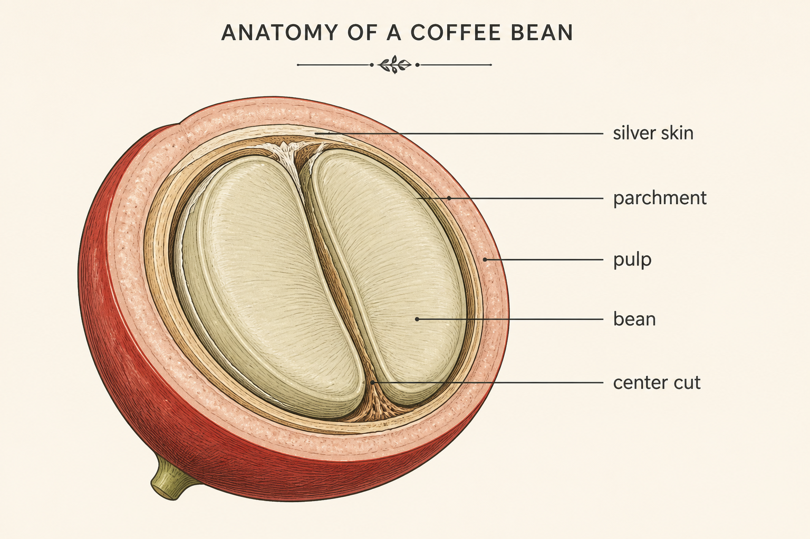

# Gallery — Diagrams & Data Viz

Charts, infographics, scientific figures, paper figures.

See `gallery-posters.md` for the entry template.

---

## Anatomical diagram — coffee bean cross-section

**Provider**: openai · **Model**: gpt-image-2 · **Quality**: low · **Size**: landscape

**Prompt**:
```
Educational textbook-style diagram, anatomy of a coffee bean cross-section, labeled parts with thin charcoal leader lines pointing to each part: 'silver skin', 'parchment', 'pulp', 'bean', 'center cut'. Detailed line illustration on warm cream background, subtle natural-tone fills, label text in clean sans-serif. Botanical-illustration aesthetic.
```

**Notes**: Quote every label literally — paraphrasing produces fictional anatomy. State leader-line direction with words like "thin" so they don't dominate the figure. For dense diagrams, bump to `--quality high`.

**Preview**:



---

## System architecture diagram — three tiers

**Provider**: openai · **Model**: gpt-image-2 · **Quality**: low · **Size**: landscape

**Prompt**:
```
Three-tier web application architecture diagram, three rounded rectangles arranged horizontally connected by arrows: leftmost labeled exactly 'Client (Browser)', middle labeled exactly 'API Server', rightmost labeled exactly 'Database'. Arrows between them with labels 'HTTPS', 'SQL'. Below the diagram a small legend. Clean editorial-technical illustration style, charcoal lines on cream background, single accent color.
```

**Notes**: Architecture diagrams need shape *count*, *position*, and *arrow direction* spelled out. "Three rectangles arranged horizontally" beats "show the architecture." Always quote labels literally.

**Preview**:


