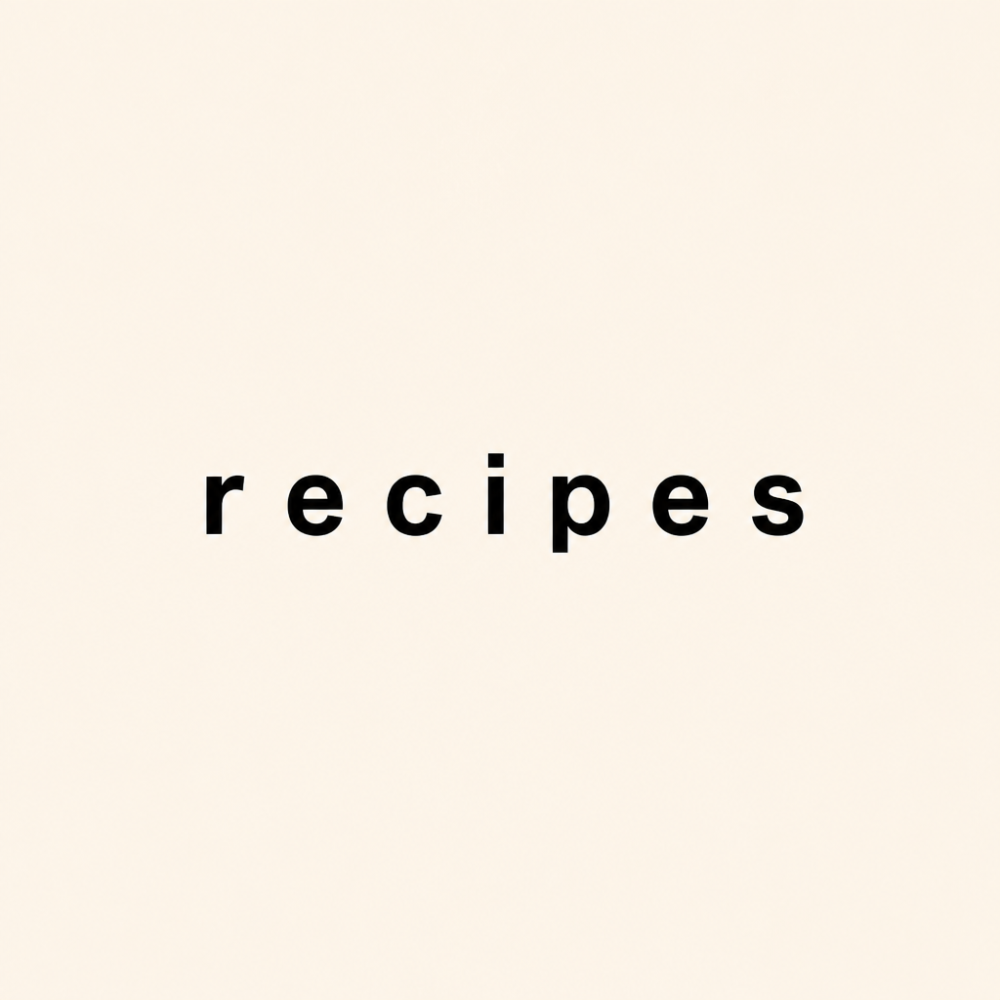

# Gallery — Edit & Inpaint

Reference-image edits, inpainting, and multi-reference workflows.

See `gallery-posters.md` for the entry template. Edits use the `-i` flag (one or more reference images); inpainting also uses `-m` (PNG alpha mask).

---

## Text swap on a typographic poster

**Provider**: openai · **Model**: gpt-image-2 · **Quality**: low · **Size**: square · **Mode**: edit (`-i`)

**Reference**: `docs/posters/poster-01-typographic-cookbook.png`

**Prompt**:
```
Edit the reference image. PRESERVE: the cream background, the layout, the bold sans-serif typography, the centered placement. CHANGE: replace the word 'cookbook' with the word 'recipes' in the same font and weight. Do not alter anything else.
```

**Command**:
```bash
gic -p "Edit the reference image. PRESERVE: the cream background, the layout, the bold sans-serif typography, the centered placement. CHANGE: replace the word 'cookbook' with the word 'recipes' in the same font and weight. Do not alter anything else." \
  -i docs/posters/poster-01-typographic-cookbook.png \
  -f docs/edits/edit-01-typographic-text-swap.png
```

**Notes**: Edits must lead with an explicit `PRESERVE:` clause and an explicit `CHANGE:` clause. Without `PRESERVE:` the model redraws too much. Without `CHANGE:` it drifts. Quote the literal old word and the literal new word — not "swap the title" but "replace 'cookbook' with 'recipes'."

**Preview**:



---

## Inpaint pattern (template)

For inpainting you also need a PNG mask where the alpha channel marks the region to fill.

**Command shape**:
```bash
gic -p "Within the masked region only, [describe what fills the masked area]. Match the lighting, perspective, and grain of the surrounding image." \
  -i reference.png -m mask.png -f out.png
```

**Notes**: The mask must be a PNG with an alpha channel; the transparent (alpha = 0) pixels mark the inpaint region. The prompt should describe ONLY what fills the masked area, plus a "match the surrounding image" directive so the inpaint blends.

---

## Multi-reference pattern (template)

Pass multiple `-i` flags to feed several references; the model combines them.

**Command shape**:
```bash
gic -p "Combine the subject from the first reference with the lighting and palette of the second reference." \
  -i subject.png -i style.png -f out.png
```

**Notes**: Be explicit about which reference contributes what ("subject from first," "lighting from second"). Otherwise the model averages.
