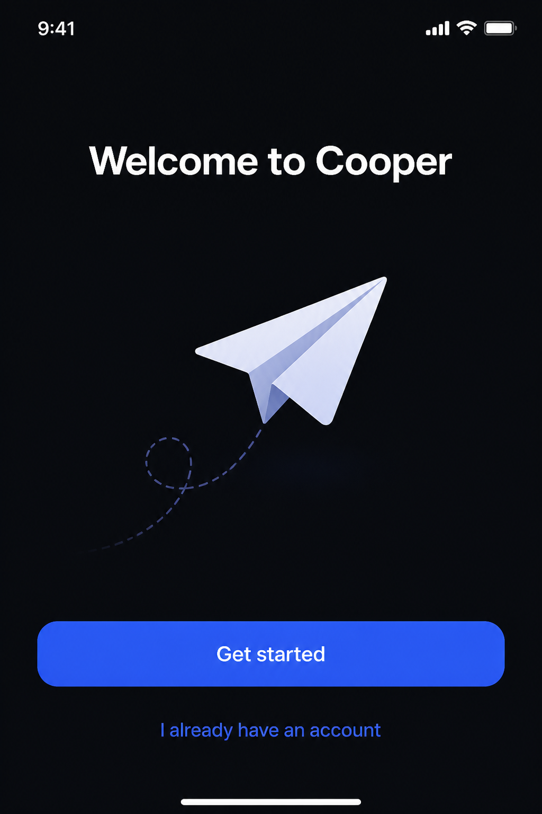

# Gallery — UI / UX Mockups

App screens, dashboards, settings UI, web layouts.

See `gallery-posters.md` for the entry template.

---

## Mobile onboarding screen — dark mode

**Provider**: openai · **Model**: gpt-image-2 · **Quality**: low · **Size**: portrait

**Prompt**:
```
iOS mobile app onboarding screen, dark mode, centered illustration of a paper airplane, headline reads exactly 'Welcome to Cooper', single primary CTA button at bottom reads exactly 'Get started', secondary text-link below reads exactly 'I already have an account'. Minimalist, generous spacing, system sans-serif.
```

**Notes**: Pinning every label in quotes is the trick — without it the model invents copy. State the platform ("iOS") explicitly so the chrome looks right.

**Preview**:



---

## SaaS analytics dashboard — light mode

**Provider**: openai · **Model**: gpt-image-2 · **Quality**: low · **Size**: landscape

**Prompt**:
```
SaaS analytics dashboard, web app, light mode, three-column layout. Left sidebar with 6 nav items: 'Home', 'Reports', 'Customers', 'Billing', 'Team', 'Settings'. Main panel: large line chart titled exactly 'Revenue, last 30 days', two stat cards above showing 'MRR $42,180' and 'Churn 2.4%'. Top bar with search field and avatar circle right-aligned. Refined design system look.
```

**Notes**: Listing every nav item by literal name keeps the model from inventing labels. Specify the chart type and what it shows — "line chart titled 'Revenue'" beats "a chart showing growth."

**Preview**:


